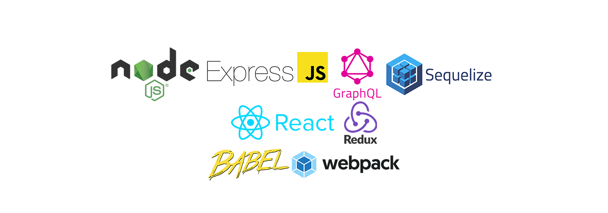

<!-- PROJECT SHIELDS -->
<!--
*** I'm using markdown "reference style" links for readability.
*** Reference links are enclosed in brackets [ ] instead of parentheses ( ).
*** See the bottom of this document for the declaration of the reference variables
*** for contributors-url, forks-url, etc. This is an optional, concise syntax you may use.
*** https://www.markdownguide.org/basic-syntax/#reference-style-links
-->

[![Contributors][contributors-shield]][contributors-url]
[![Forks][forks-shield]][forks-url]
[![Stargazers][stars-shield]][stars-url]
[![Issues][issues-shield]][issues-url]
[![MIT License][license-shield]][license-url]
[![LinkedIn][linkedin-shield]][linkedin-url]

<!-- PROJECT LOGO -->
<br />
<p align="center">
  <a href="https://github.com/AlfredRodriguez2042/cms">
    
  </a>

  <h3 align="center">CMS</h3>

  <p align="center">
   a little system blog with react and node
    <br />
    <a href="https://github.com/github_username/repo"><strong>Explore the docs »</strong></a>
    <br />
    <br />
    <a href="https://github.com/github_username/repo">View Demo</a>
    ·
    <a href="https://github.com/github_username/repo/issues">Report Bug</a>
    ·
    <a href="https://github.com/github_username/repo/issues">Request Feature</a>
  </p>
</p>

<!-- TABLE OF CONTENTS -->

## Table of Contents

- [About the Project](#about-the-project)
  - [Built With](#built-with)
- [Getting Started](#getting-started)
  - [Prerequisites](#prerequisites)
  - [Installation](#installation)
- [Usage](#usage)
- [Roadmap](#roadmap)
- [Contributing](#contributing)
- [License](#license)
- [Contact](#contact)
- [Acknowledgements](#acknowledgements)

<!-- ABOUT THE PROJECT -->

## About The Project

[![Product Name Screen Shot][product-screenshot]](https://example.com)

### Built With

#### Frontend

- [React]() para crear la ui de manera rapida
- [Redux]() para conectar los componetes en un solo estado
- [Material-ui]() -.-!
- [Apollo-Client]() para conectarme al servicio de graphql
- [antd-Desing]() mejora el render en los componentes

#### Backend

- [Node]() simple y sencillo de usar
- [Apollo-Server]() usando Graphql y express para construir un servicio rapido y seguro
- [Express-Session]() guardar las sesiones seguras en los headers
- [JWT]() para iniciar sesiones seguras con cookies
- [Sequelize]() ORM para poder trabajar con postgres
- [Babel]() para poder usar es6

#### Database

- [Postgres]() como base de datos principal
- [Redis]() para guardar sesiones y como cache
-

#### Orchestration

- [Docker]() para controlar la creacion y configuracion de contenedores, monitorizar el funcionamiento de los contenedores y en caso de fallos volver a levantarlo o crearlos
  <p align="center">
   
  </p>

<!-- GETTING STARTED -->

## Getting Started

To get a local copy up and running follow these simple steps.

### Prerequisites

This is an example of how to list things you need to use the software and how to install them.

- Docker

```sh
sudo apt install docker-compose
```

- Node v13.11

```sh
node --version
```

- npm

```sh
npm install npm@latest -g
```

### Installation

1. Clone the repo

```sh
git clone https://github.com/AlfredRodriguez2042/cms
```

2. Install NPM packages

```sh
cd server/ npm install
```

```sh
cd client/ npm install
```

3. Run Docker

```sh
docker-compose up
```

<!-- USAGE EXAMPLES -->

## Usage

1. first connect to container and create db

```sh
 docker exec -it mypostgres psql -U postgres
```

```sh
 CREATE DATABASE practica;
```

2. cd server/

```sh
 npm start  or npm run dev
```

3. cd client

```sh
 npm start
```

4. monitorin system and containers

localhost:19999

<!-- aca van los ejemplos -->

_For more examples, please refer to the [Documentation](https://example.com)_

<!-- ROADMAP -->

## Roadmap

See the [open issues](https://github.com/github_username/repo/issues) for a list of proposed features (and known issues).

<!-- CONTRIBUTING -->

## Contributing

Contributions are what make the open source community such an amazing place to be learn, inspire, and create. Any contributions you make are **greatly appreciated**.

1. Fork the Project
2. Create your Feature Branch (`git checkout -b feature/AmazingFeature`)
3. Commit your Changes (`git commit -m 'Add some AmazingFeature'`)
4. Push to the Branch (`git push origin feature/AmazingFeature`)
5. Open a Pull Request

<!-- LICENSE -->

## License

Distributed under the MIT License. See `LICENSE` for more information.

<!-- CONTACT -->

## Contact

Your Name - [linkedin](www.linkedin.com/in/alfredrodriguez2042) - email

Project Link: [https://github.com/AlfredRodriguez2042/cms](https://github.com/AlfredRodriguez2042/cms)

<!-- ACKNOWLEDGEMENTS -->

## Acknowledgements

- []()
- []()
- []()

<!-- MARKDOWN LINKS & IMAGES -->
<!-- https://www.markdownguide.org/basic-syntax/#reference-style-links -->

[contributors-shield]: https://img.shields.io/github/contributors/Alfredrodriguez2042/cms.svg?style=flat-square
[contributors-url]: https://github.com/AlfredRodriguez2042/cms/graphs/contributors
[forks-shield]: https://img.shields.io/github/forks/Alfredrodriguez2042/cms.svg?style=flat-square
[forks-url]: https://github.com/AlfredRodriguez2042/cms/network/members
[stars-shield]: https://img.shields.io/github/stars/Alfredrodriguez2042/cms.svg?style=flat-square
[stars-url]: https://github.com/AlfredRodriguez2042/cms/stargazers
[issues-shield]: https://img.shields.io/github/issues/Alfredrodriguez2042/cms.svg?style=flat-square
[issues-url]: https://github.com/AlfredRodriguez2042/cms/issues
[license-shield]: https://img.shields.io/github/license/Alfredrodriguez2042/cms.svg?style=flat-square
[license-url]: https://github.com/othneildrew/Best-README-Template/blob/master/LICENSE.txt
[linkedin-shield]: https://img.shields.io/badge/-LinkedIn-black.svg?style=flat-square&logo=linkedin&colorB=555
[linkedin-url]: https://linkedin.com/in/alfredrodriguez2042
[product-screenshot]: images/screenshot.png
